# NAAb — Stop AI Agents Before They Do Damage

[](https://github.com/b-macker/NAAb/actions/workflows/ci.yml)
[](https://github.com/b-macker/NAAb/actions/workflows/sanitizers.yml)
[](https://github.com/b-macker/NAAb/actions/workflows/codeql.yml)
[](https://opensource.org/licenses/MIT)
[](CONTRIBUTING.md)
[](https://github.com/b-macker/NAAb/discussions)

AI agents can read your secrets, encode them, and send them to an external API — all in three steps. NAAb blocks the sequence **before the network call fires.**

```
$ naab-lang agent_task.naab

[governance] Behavioral sequence 'credential_exfiltration' blocked before execution.

  Pattern matched:
    Step 1 — env.get("API_SECRET_KEY")        ✓ matched
    Step 2 — crypto.base64_encode(secret)     ✓ matched
    Step 3 — agent.send(handle, encoded)      ✗ BLOCKED

  Rule: behavioral_sequences.credential_exfiltration [HARD]
  The sequence env.get:*KEY* → encode → agent.send matches a known
  exfiltration pattern. Execution was stopped before the API call.
```

No prompt engineering. No post-hoc log scanning. The agent never reaches the network.

---

## How It Works

NAAb is a programming language with a governance engine built into the runtime. You define behavioral rules in `govern.json` — multi-step attack patterns, capability limits, secret scanning — and the engine enforces them as your code runs, not after.

```json
{
  "version": "5.0",
  "mode": "enforce",
  "behavioral_sequences": {
    "enabled": true,
    "patterns": [
      {
        "name": "credential_exfiltration",
        "sequence": ["env.get:*KEY*|*SECRET*|*TOKEN*", "encode|base64", "agent.send|http.post"],
        "level": "hard",
        "rationale": "Reading credentials then encoding and sending matches exfiltration."
      },
      {
        "name": "config_harvest",
        "sequence": ["file.read:*config*|file.read:*govern*", "agent.send"],
        "level": "hard",
        "rationale": "Reading config files then sending content to an external agent."
      }
    ]
  }
}
```

The patterns are yours to define. The engine tracks event sequences across your entire script — with configurable gap limits, decay timers, and enforcement tiers — and blocks the final step before it executes.

### What Else Gets Blocked

| Threat | How NAAb stops it |
|--------|-------------------|
| Credential exfiltration | Sequence detection — `env.get(SECRET)` → encode → `agent.send` blocked pre-execution |
| Config harvesting | `file.read(govern.json)` → `agent.send` blocked before API call |
| Agent drift | Context Drift Detection tracks coherence across turns — circular loops, scope creep, contradictions |
| Leaked secrets in responses | `checkSecrets()` scans every agent response — API keys, JWTs, hardcoded passwords hard-blocked |
| Capability abuse | `filesystem: read` mode, `shell: disabled` — enforced at sandbox level, not by prompt |
| Tainted data reaching shell | VM taint tracking — `env.get` output reaching `shell_exec` blocked with full lineage trace |

### Governance That Can't Be Bypassed

Rules live in `govern.json`, not in prompts. A signed govern.json with Ed25519 means the agent can't modify its own constraints mid-run. A one-way ratchet ensures mid-run reloads can only tighten rules, never loosen them.

```bash
naab-lang --keygen ./keys/governance
naab-lang --sign-governance                    # Sign govern.json
naab-lang --trust-key ./keys/governance.pub   # Install on CI
```

---

## See It In Action

<p align="center">
  
</p>

| Scene | AI Mistake | Governance Response |
|-------|-----------|-------------------|
| 1 | `.push()` in Python | Blocked — use `.append()` |
| 2 | `import fake_ai_toolkit` | Blocked — unknown module |
| 3 | `fn validate() { return true }` | Blocked — stub function |
| 4 | Hardcoded `sk-proj-...` API key | Blocked — secret detected |
| 5 | Empty `catch (e) { }` | Blocked — incomplete logic |
| 6 | `env.get()` → shell unsanitized | Blocked — taint violation |
| 7 | All issues fixed | Passes clean |

Run it yourself: `bash demo/governance_demo.sh` | Record: `bash demo/governance_demo.sh --record`

---

## The Problem: AI Code Drift

AI models generate code that looks right but isn't. Every session starts fresh — no memory of your security rules, naming conventions, or architecture decisions:

- **Hallucinated APIs** — `.push()` in Python, `print()` in JavaScript, `json.stringify()` instead of `json.dumps()`
- **Stubs shipped as "complete"** — `def validate(): return True`, functions with only `pass` or `NotImplementedError`
- **Security patterns bypassed** — hardcoded secrets, SQL injection, `except: pass` swallowing errors
- **Language misuse** — Python for heavy computation, JavaScript for file operations, Shell for complex logic

Prompts are suggestions. **`govern.json` is policy.** NAAb checks every polyglot block against your policies before execution — where it can't be bypassed.

---

## At a Glance

| Capability | Details |
|---|---|
| **Governance Engine** | 50+ checks, 4-tier policy engine (hard / soft / advisory / detect), `govern.json` config |
| **Polyglot Execution** | 12 languages in one file — Python, JavaScript, Rust, C++, Go, C#, Ruby, PHP, Shell, Nim, Zig, Julia |
| **Smart Error Messages** | "Did you mean?" suggestions via Levenshtein distance, detailed fixes with examples |
| **Standard Library** | 24 registered modules — array, string, math, json, http, file, path, time, debug, dict, env, csv, regex, crypto, log, uuid, validate, process, io, bolo, agent, governance, codegen, orchestra |
| **Language Features** | Generators/yield, interfaces, pattern matching with guards, f-strings, async/await, lambdas, closures, pipeline, destructuring |
| **CI/CD Integration** | SARIF (GitHub Code Scanning), JUnit XML (Jenkins/GitLab), JSON reports |
| **Project Context** | Auto-reads CLAUDE.md, .editorconfig, .eslintrc, package.json to supplement governance |
| **Developer Tools** | Interactive REPL, URL imports, LLM-friendly syntax (keyword aliases, optional semicolons), 204 error messages |
| **Bytecode VM** | Stack-based compiler + VM (default engine, ~8x faster than tree-walking), computed goto dispatch, NaN-boxing fast paths, constant folding |
| **Runtime Security** | Behavioral Sequence Detection (BSD), Context Drift Detection (CDD), VM taint lineage tracking, polyglot subprocess containment |
| **Ed25519 Signing** | Trust-anchored governance — `--keygen`, `--sign-governance`, `--trust-key`, one-way ratchet |
| **Cumulative Scoring** | Advisory findings accumulate weighted scores — green/yellow/red zones with configurable thresholds |
| **Agent Governance** | Multi-agent role enforcement, per-agent permissions, standing lease TTL, advisory escalation, output contracts, telemetry JSONL |
| **Governance Pulse** | Real-time health monitoring (HEALTHY/DEGRADED/IMPAIRED), evidence epochs, governance entropy detection |
| **Multi-Agent Orchestration** | `orchestra` module — sequential refinement, consensus voting, convergence enforcement |
| **Dynamic Code Execution** | `codegen.run()` — governed runtime code generation with same 39+ checks as static polyglot blocks |
| **Enterprise Features** | Policy inheritance (`extends`), telemetry forwarding (webhook/SIEM), REST API multi-key auth, polyglot hot-reload |
| **Subprocess Containment** | OS-level restrictions on polyglot child processes — RLIMIT_NPROC, PATH restriction, env scrubbing, timeout |

---

## Quick Start

```bash
# Clone and build
git clone --recursive https://github.com/b-macker/NAAb.git
cd NAAb
mkdir build && cd build
cmake .. -G Ninja
ninja naab-lang -j$(nproc)

# Run a file
./naab-lang hello.naab

# Start interactive REPL
./naab-lang
```

Detailed build instructions: [INSTALL.md](INSTALL.md) · Language guide: [USER_GUIDE.md](USER_GUIDE.md) · Release history: [CHANGELOG.md](CHANGELOG.md)

### Hello World

```naab
main {
    let name = "World"
    print("Hello, " + name + "!")
}
```

---

## Governance Engine

NAAb's governance engine is what sets it apart. Drop a `govern.json` in your project root and every polyglot block is checked before execution.

### What It Catches

| Category | Examples | Patterns |
|---|---|---|
| **Hallucinated APIs** | `.push()` in Python, `print()` in JS, `len()` in JS | 86+ cross-language patterns |
| **Oversimplification** | `def validate(): return True`, `pass`-only bodies, identity functions | 35+ stub patterns |
| **Incomplete Logic** | `except: pass`, bare raises, `"something went wrong"` messages | 40+ patterns |
| **Security** | SQL injection, path traversal, shell injection, hardcoded secrets | Entropy-based detection |
| **Code Quality** | TODO/FIXME, debug artifacts, mock data, hardcoded URLs/IPs | Dead code detection |
| **Taint Tracking** | Untrusted data (`env.get`, polyglot output) reaching sinks (shell, env) | Source/sink/sanitizer with prefix matching |
| **PII Exposure** | SSN patterns, credit card numbers, API keys in strings | Regex + entropy |

### Four Policy Levels

- **HARD** — Block execution. Code does not run. No override. Throws uncatchable `GovernanceHardError` (NAAb `try/catch` cannot intercept it). Process exits with code 3.
- **SOFT** — Block execution. Code does not run unless `--governance-override` is passed.
- **ADVISORY** — Warn and continue. Logged in audit trail. Repeated advisories escalate to SOFT via advisory escalation.
- **DETECT** — Same detection as HARD but throws catchable exception. Used in test configurations where scripts verify violations via `try/catch`.

### govern.json Example

```json
{
  "version": "5.0",
  "mode": "enforce",

  "languages": {
    "allowed": ["python", "javascript", "go"],
    "blocked": ["php"]
  },

  "code_quality": {
    "no_secrets": { "level": "hard" },
    "no_sql_injection": { "level": "hard" },
    "no_oversimplification": { "level": "hard" },
    "no_incomplete_logic": { "level": "soft" },
    "no_hallucinated_apis": { "level": "soft" }
  },

  "restrictions": {
    "no_eval": { "level": "hard" },
    "no_shell_injection": { "level": "hard" }
  },

  "limits": {
    "max_lines_per_block": 200,
    "timeout_seconds": 30
  }
}
```

### Project Context Awareness

NAAb can read your existing project configuration files and supplement governance rules — without overriding `govern.json`:

- **Layer 1:** LLM instruction files — `CLAUDE.md`, `.cursorrules`, `AGENTS.md`
- **Layer 2:** Linter configs — `.eslintrc`, `.flake8`, `pyproject.toml`
- **Layer 3:** Project manifests — `package.json`, `Cargo.toml`, `go.mod`

Each layer is opt-in and toggleable.

### Custom Rules

Define your own regex-based governance rules:

```json
{
  "custom_rules": [
    {
      "name": "no_print_debugging",
      "pattern": "console\\.log|print\\(.*debug",
      "message": "Remove debug print statements before committing",
      "level": "soft"
    }
  ]
}
```

### CI/CD Integration

```bash
# GitHub Code Scanning (SARIF)
naab-lang app.naab --governance-report sarif > results.sarif

# Jenkins / GitLab CI (JUnit XML)
naab-lang app.naab --governance-report junit > results.xml

# Custom tooling (JSON)
naab-lang app.naab --governance-report json > results.json
```

> **[Build your govern.json interactively](https://b-macker.github.io/NAAb/governance.html)** | [Full governance reference (Chapter 21)](docs/book/chapter21.md)
>
> **[Security model & threat assumptions](docs/SECURITY.md)**

### Agent Governance

NAAb supports multi-agent environments where different AI agents have different permissions. Define per-agent configs in `govern.json`:

```json
{
  "agents": {
    "analyzer": {
      "provider": "gemini",
      "model": "gemini-2.5-flash",
      "api_key_env": "GEMINI_API_KEY",
      "system_prompt": "You are a code analyzer.",
      "max_turns": 20,
      "max_tokens": 4096,
      "allowed_languages": ["python", "javascript"],
      "allowed_actions": ["AGENT_SEND", "FS_READ"],
      "standing_lease_turns": 10,
      "risk_budget": 15,
      "output_contract": {
        "format": "json",
        "required_fields": ["severity", "category"],
        "regex_checks": { "severity": "^(low|medium|high|critical)$" }
      }
    }
  }
}
```

```bash
# Run with agent identity
naab-lang --agent-id analyzer app.naab

# View governance dashboard
naab-lang --agent-id analyzer --governance-dashboard app.naab
```

**Agent features:**
- **Standing Lease** — TTL on agent authorization. Expired lease forces step-up challenge.
- **Output Contracts** — validate LLM response structure against a schema (required fields, types, regex).
- **Risk Budget** — finite risk budget consumed by BSD matches and CDD signals. Agent blocked when exhausted.
- **Key Rotation** — `api_key_env` accepts string or array. Dead keys (401) marked and rotated. `key_retry_after_seconds` enables revival.
- **Model Fallback** — `model` accepts string or array. On 404/503, next model in chain is tried.
- **Tool Execution** — `agent.register_tool()` + governed tool loop with 7 defense layers.
- **Code Extraction** — `agent.extract_code(response, lang)` extracts code from markdown fences.
- **Environment Awareness** — `agent.environment(handle)` returns real-time config, state, and health.

### Runtime Security: BSD, CDD & Subprocess Containment

Beyond static checks, NAAb monitors runtime behavior patterns:

- **Behavioral Sequence Detection (BSD)** — catches multi-step attack patterns like "read secrets → encode → exfiltrate". Patterns are fully configurable in govern.json — no hardcoded rules. Dangerous sequences are blocked *before* the final step executes. Pattern names accept both UPPERCASE_UNDERSCORE and lowercase.dot notation.
- **Context Drift Detection (CDD)** — monitors LLM agent conversations for coherence drift: repeated failures, circular actions, scope creep, contradictions. Configurable thresholds and per-signal weights. 8 signals including coherence velocity, vocabulary contraction, capability underutilization, and semantic stability.
- **VM Taint Lineage** — every tainted value carries a full chain showing where it was tainted and why, making governance violations actionable.
- **Governance Pulse** — real-time self-assessment (HEALTHY/DEGRADED/IMPAIRED) with hysteresis and evidence epochs. `governance.health()` returns instrumentation status.
- **Polyglot Subprocess Containment** — OS-level restrictions on child processes: RLIMIT_NPROC=0 (blocks fork), PATH restriction, environment scrubbing, timeout with SIGKILL. Catches runtime-constructed commands that evade static source scanning.

### Ed25519 Governance Signing

Trust-anchored signing ensures govern.json integrity:

```bash
# Generate keypair
naab-lang --keygen ./keys/governance

# Sign govern.json
naab-lang --signing-key ./keys/governance.key --sign-governance

# Install public key on CI/team machines
naab-lang --trust-key ./keys/governance.pub
```

Signed governance enforces a one-way ratchet — mid-run config reloads can only tighten restrictions, never loosen them.

---

## Polyglot Execution

Use each language where it shines — Python for data science, Rust for performance, JavaScript for web, Go for concurrency, Shell for file ops. Variables flow between languages automatically. No FFI, no serialization, no microservices.

**Supported languages:** Python · JavaScript · Rust · C++ · Go · C# · Ruby · PHP · Shell · Nim · Zig · Julia

> Zig and Julia executors ship with the runtime but are disabled by default in `naab.toml` — flip `zig = true` / `julia = true` under `[polyglot]` to enable them.

```naab
main {
    let numbers = [10, 20, 30, 40, 50]

    // Python: statistical analysis
    let stats = <<python[numbers]
import statistics
result = {
    "mean": statistics.mean(numbers),
    "stdev": statistics.stdev(numbers)
}
str(result)
>>

    // JavaScript: format as HTML
    let html = <<javascript
const data = "Stats: mean=30, stdev=15.81";
`<div class="result">${data}</div>`;
>>

    print(stats)
    print(html)
}
```

### Key Polyglot Features

- **Variable binding** — Pass NAAb variables into polyglot blocks with `<<python[x, y]`
- **Parallel execution** — Independent blocks run concurrently with automatic dependency analysis
- **Persistent runtimes** — Keep interpreter state across multiple calls with the `runtime` keyword
- **JSON sovereign pipe** — Return structured data from any language with `naab_return()` or `-> JSON` header
- **Error mapping** — Polyglot errors map back to NAAb source locations and flow into try/catch
- **Block-header awareness** — Go gets `package main`, PHP gets `<?php` automatically

---

## Language Features

### Pattern Matching

```naab
main {
    let status = 404

    let message = match status {
        200 => "OK"
        404 => "Not Found"
        n if n >= 500 => f"Server Error ({n})"  // guard clause
        _ => "Unknown"
    }

    print(message)  // "Not Found"

    // Array destructuring in match
    let point = [3, 4]
    let label = match point {
        [0, 0] => "origin"
        [x, 0] => f"on x-axis at {x}"
        [0, y] => f"on y-axis at {y}"
        [x, y] => f"point ({x}, {y})"
    }
    print(label)  // "point (3, 4)"
}
```

### Async/Await

```naab
main {
    async fn fetch_data() {
        return "data loaded"
    }

    async fn process() {
        return "processed"
    }

    let data = await fetch_data()
    let result = await process()
    print(data + " -> " + result)
}
```

### Lambdas & Closures

```naab
main {
    let multiplier = 3
    let scale = fn(x) { return x * multiplier }

    print(scale(10))  // 30

    // Closures capture their environment
    function make_counter() {
        let count = 0
        return fn() {
            count = count + 1
            return count
        }
    }

    let counter = make_counter()
    print(counter())  // 1
    print(counter())  // 2
}
```

### Pipeline Operator

```naab
main {
    let result = "hello world"
        |> string.upper()
        |> string.split(" ")

    print(result)  // ["HELLO", "WORLD"]
}
```

### If Expressions

```naab
main {
    let score = 85
    let grade = if score >= 90 { "A" } else if score >= 80 { "B" } else { "C" }
    print(grade)  // "B"
}
```

### Error Handling

```naab
main {
    try {
        let result = <<python
raise ValueError("something broke")
>>
    } catch (e) {
        print("Caught from Python: " + e)
    }
}
```

### Generators

```naab
fn fibonacci(limit) {
    let a = 0
    let b = 1
    while a < limit {
        yield a
        let temp = a + b
        a = b
        b = temp
    }
}

main {
    for n in fibonacci(100) {
        print(n)  // 0, 1, 1, 2, 3, 5, 8, 13, 21, 34, 55, 89
    }
}
```

### Interfaces

```naab
interface Printable {
    fn to_string() -> string
}

struct Point implements Printable {
    x: int
    y: int
}

fn Point.to_string(p) -> string {
    return f"({p.x}, {p.y})"
}

main {
    let p = new Point { x: 3, y: 4 }
    print(Point.to_string(p))  // "(3, 4)"
}
```

### F-Strings

```naab
main {
    let name = "World"
    let count = 42
    print(f"Hello {name}, you have {count} items")
    print(f"Total: {count * 2}")  // expressions work too
}
```

### More Language Features

- Optional chaining (`user?.name`), null coalescing (`x ?? "default"`, `x ??= fallback`)
- Destructuring (`let [a, b] = arr`, `let {x, y} = dict`)
- Spread/rest (`[...arr1, ...arr2]`, `fn(...args)`)
- `in` / `not in` operators, array slicing (`arr[1:3]`)
- Structs, enums, module system with imports/exports/URL imports
- For loops with destructuring, while loops, break/continue
- Dictionaries and arrays with dot-notation methods

---

## Standard Library

24 modules with 204 error messages, "Did you mean?" suggestions, and detailed documentation.

```naab
main {
    // JSON
    let data = json.parse('{"name": "NAAb", "type": "language"}')
    print(data["name"])

    // HTTP
    let response = http.get("https://api.github.com/repos/b-macker/NAAb")
    print(json.parse(response)["stargazers_count"])

    // File I/O
    file.write("output.txt", "Hello from NAAb!")

    // Math
    print(math.sqrt(144))  // 12

    // String operations
    let words = string.split("hello world", " ")
    print(string.upper(words[0]))  // "HELLO"
}
```

| Module | Functions |
|---|---|
| `array` | push, pop, shift, unshift, map_fn, filter_fn, reduce_fn, sort, slice_arr, find, reverse, length, contains, first, last, join |
| `string` | split, join, upper, lower, trim, replace, reverse, contains, starts_with, ends_with, length, char_at, index_of, substring, repeat, pad_left, pad_right |
| `math` | sqrt, pow, abs, floor, ceil, round, min, max, sin, cos, random, PI, E |
| `json` | parse, stringify |
| `http` | get, post, put, delete, head, patch (with headers, body, timeout) |
| `file` | read, write, append, exists, delete, list_dir, create_dir, is_file, is_dir, read_lines, write_lines, copy, move, size, basename, dirname, extension |
| `path` | join, dirname, basename, extension, resolve, is_absolute, normalize, exists |
| `time` | now, now_millis, sleep, format_timestamp, parse_datetime, year, month, day, hour, minute, second, weekday |
| `debug` | inspect, type, trace, watch, snapshot, diff, keys, values, log, timer, compare, stack, env |
| `env` | get, set_var, list |
| `csv` | parse, stringify |
| `regex` | search, matches, find, find_all, replace, replace_first, split, groups, find_groups, escape, is_valid |
| `crypto` | hash, sha256, sha512, md5, sha1, random_bytes, random_string, random_int, base64_encode, base64_decode, hex_encode, hex_decode, compare_digest, generate_token, hash_password |
| `dict` | get, get_or, has_key, keys, values, entries, merge, size |
| `io` | print, println, input, read_line, read_file, write_file, write_error, exists, list_dir |
| `log` | debug, info, warn, error, set_level, get_level, set_format, set_output |
| `process` | run, exit, getpid, kill |
| `uuid` | v4, v5, nil, is_valid |
| `validate` | email, url, ip, ipv6, is_int, is_float, is_string, int_range, length, matches, not_empty |
| `agent` | create, send, run, extract_code, register_tool, batch, fan_out, pipeline, check, key_health, dispatch_status, environment |
| `codegen` | run, run_with_args, run_strict, supported_languages, is_enabled |
| `orchestra` | sequential_refinement, consensus_vote, enforce_convergence |
| `governance` | health |
| `bolo` | scan, report (governance integration) |

---

## Developer Experience

### Smart Error Messages

NAAb doesn't just tell you what's wrong — it tells you how to fix it:

```
Error: Unknown function "array.pussh"

  Did you mean: array.push ?

  Help:
  - array.push(arr, value) adds an element to the end of an array

  Example:
    ✗ Wrong: array.pussh(my_list, 42)
    ✓ Right: array.push(my_list, 42)
```

### Common Mistake Detection

NAAb detects ~35 patterns where developers (and AI) use the wrong language's idioms:

- `array.append()` → "That's Python. In NAAb, use `array.push()`"
- `console.log()` → "That's JavaScript. In NAAb, use `print()`"
- `str.upper()` → "Use `string.upper(str)` or `str.upper()` (dot-notation)"

### LLM-Friendly Syntax

NAAb accepts multiple keyword styles so AI-generated code works without manual edits:

- `function` / `func` / `fn` / `def` — all valid
- `let` / `const` — mutable and immutable bindings
- Semicolons — optional (accepted but not required)
- `return` — optional in single-expression functions

### Tooling

- **`naab-lsp`** — Language Server Protocol implementation (`tools/naab-lsp/`), built and installed alongside the main binary. Powers the [VS Code extension](vscode-naab/).
- **`naab-gov`** — standalone governance CLI (`src/cli/gov_main.cpp`) for working with govern.json outside script execution.
- **Governance C API bindings** — embed the governance engine in other agent frameworks via `bindings/` (C#, Go, Java, Python, Rust), backed by the C API in `src/api/governance_c_api.cpp`.

---

## NAAb Ecosystem

Three tools built with NAAb — code governance, performance optimization, and data security:

| Project | Purpose | Key Features |
|---------|---------|--------------|
| **[NAAb BOLO](https://github.com/b-macker/naab-bolo)** | Code governance & validation | 50+ checks, SARIF reports, AI drift detection |
| **[NAAb Pivot](https://github.com/b-macker/naab-pivot)** | Code evolution & optimization | 3-60x speedups, proven correctness, 8 languages |
| **[NAAb Passage](https://github.com/b-macker/naab-passage)** | Data gateway & PII protection | Zero leakage, sovereign architecture, HIPAA/GDPR |

### NAAb BOLO — Code Governance & Validation

**[NAAb BOLO](https://github.com/b-macker/naab-bolo)** ("Be On the Lookout") catches oversimplified stubs, hallucinated APIs, and incomplete logic in AI-generated code.

```bash
# Scan for governance violations
naab-lang bolo.naab scan ./src --profile enterprise

# Generate SARIF report for CI
naab-lang bolo.naab report ./src --format sarif --output results.sarif

# AI governance validation
naab-lang bolo.naab ai-check ./ml-models
```

**50+ checks · 4 languages · 339 regression tests** → [Get started](https://github.com/b-macker/naab-bolo)

### NAAb Pivot — Code Evolution & Optimization

**[NAAb Pivot](https://github.com/b-macker/naab-pivot)** rewrites slow code in faster languages with mathematical proof of correctness.

```bash
# Analyze hotspots (Python → Rust candidates)
naab-lang pivot.naab analyze app.py

# Rewrite with proof
naab-lang pivot.naab rewrite app.py:expensive_loop --target rust --prove

# Result: 45x faster, semantically identical
```

**3-60x speedups · 8 source languages · Proven correct** → [Get started](https://github.com/b-macker/naab-pivot)

### NAAb Passage — Data Gateway & PII Protection

**[NAAb Passage](https://github.com/b-macker/naab-passage)** ensures zero PII leakage to LLMs, APIs, or untrusted systems with sovereign architecture.

```bash
# Start secure gateway
naab-lang main.naab

# All requests validated, PII blocked
curl -X POST http://localhost:8091/ -d '{"prompt": "SSN: 123-45-6789"}'
# → {"error": "POLICY_VIOLATION"}
```

**Zero leakage · Self-synthesizing · HIPAA/GDPR compliant** → [Get started](https://github.com/b-macker/naab-passage)

---

## Architecture

```
Source Code (.naab)
    |
  Lexer ──> Tokens
    |
  Parser ──> AST (recursive descent)
    |
  Governance Engine ──> Policy checks (govern.json)
    |
  ┌─────────────────────────────────────────────┐
  │  Compiler ──> Bytecode ──> VM (default)     │
  │       — OR —                                │
  │  Interpreter (visitor pattern, --tree-walk)  │
  └─────────────────────────────────────────────┘
    |
  ├── Native execution (NAAb code)
  ├── Python executor (C API)
  ├── JavaScript executor (QuickJS)
  ├── Go/Rust/C++/C#/Nim/Zig/Julia executors (compile & run)
  ├── Ruby/PHP executors (interpreted)
  └── Shell executor (subprocess)
```

- **120,000+** lines of C++17
- **396** regression tests, **331** mono test assertions
- **24** standard library modules with **204** error messages
- Bytecode VM default (~8x faster), tree-walker via `--tree-walk`
- Built with Abseil, fmt, spdlog, nlohmann/json, QuickJS

---

## Contributing

Contributions are welcome! See [CONTRIBUTING.md](CONTRIBUTING.md) for build instructions and guidelines.

### Areas for Contribution
- VM optimization (`src/vm/`)
- Agent governance extensions (`src/runtime/governance.cpp`)
- New standard library modules
- Documentation and tutorials
- IDE integrations (Vim, Emacs, IntelliJ, VS Code)
- Package registry (centralized module hosting)

---

## License

MIT License - see [LICENSE](LICENSE) for details.

**Brandon Mackert** - [@b-macker](https://github.com/b-macker)

---

_NAAb — Polyglot without the trip._
